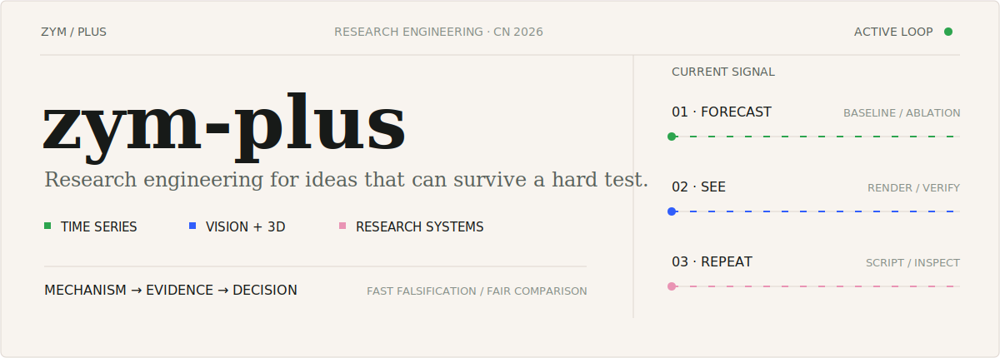
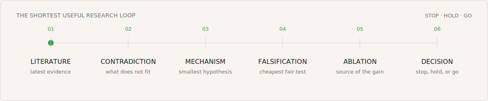

<picture>
  <source media="(max-width: 640px)" srcset="./assets/hero-mobile.svg">
  
</picture>

  <a href="https://github.com/zym-plus?tab=repositories">Repositories</a>
  &nbsp;/&nbsp;
  <a href="mailto:zymhandsomeman@gmail.com">Email</a>

### Hi, I'm zym-plus. I turn AI research questions into reproducible evidence.

I develop **models, experiment pipelines, and verification tools** across time-series forecasting, vision and 3D, and GPU research infrastructure. My default loop is simple: isolate a mechanism, design the shortest fair test, and keep only what survives strong baselines and ablation.

  <picture>
    <source media="(prefers-reduced-motion: reduce)" srcset="./assets/character-interaction-static.png">
    
  </picture>

## Current work

**01 / Time-series forecasting** 
When does a new mechanism beat a strong simple baseline for the right reason? 
`Fair splits` · `Per-horizon comparison` · `Fast falsification` · `Ablation-first evidence`

**02 / Vision and 3D** 
Can a model improve a reconstruction or image pipeline in ways we can see and measure? 
`End-to-end training` · `Visual verification` · `Reproducible evaluation`

**03 / Research systems** 
How do we make GPU experiments easier to repeat, inspect, and hand off? 
`Scripted environments` · `Structured logs` · `WSL/Linux automation`

## Research loop

<picture>
  <source media="(max-width: 640px)" srcset="./assets/research-loop-mobile.svg">
  
</picture>

The artifact I care about is not just a checkpoint. It is a reproducible argument: **theory, code, controls, logs, and a clear decision**.

## Engineering profile

- **Models** — Small PyTorch modules with explicit hypotheses, shape contracts, and removable core mechanisms.
- **Experiments** — Reproducible runs with fixed splits, strong local baselines, smoke tests, and multi-seed checks.
- **Verification** — Result summaries, failure analysis, plots, image inspection, and contribution-source audits.
- **Infrastructure** — CUDA workloads on Linux/WSL, shell automation, isolated environments, and GitHub Actions.

## Working stack

`Python` · `PyTorch` · `CUDA` · `NumPy` · `Pandas` · `OpenCV` · `Bash` · `Linux / WSL` · `GitHub Actions`

## Activity

Open generated contribution view

<picture>
  <source media="(prefers-color-scheme: dark)" srcset="./profile-3d-contrib/profile-night-green.svg">
  
</picture>

The contribution view is generated from public GitHub activity by [`yoshi389111/github-profile-3d-contrib`](https://github.com/yoshi389111/github-profile-3d-contrib) and refreshed by GitHub Actions. It is activity context, not a productivity score.

## Contact

Good conversations usually start with a concrete contradiction, a reproducibility problem, or a result that deserves a harder baseline. [Send a note](mailto:zymhandsomeman@gmail.com?subject=Research%20conversation).
