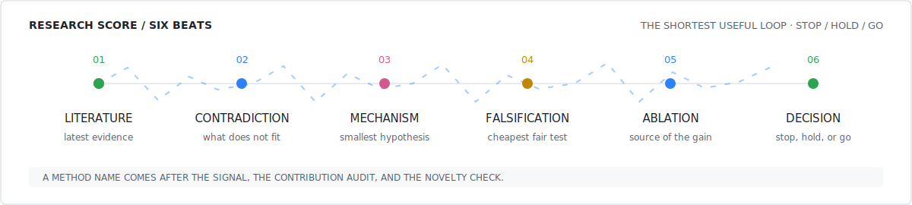

<a href="#research-deck">
  <picture>
    <source media="(max-width: 640px)" srcset="./assets/signal-lab-mobile.svg">
    
  </picture>
</a>

[Research deck](#research-deck) · [Selected work](#selected-work) · [Live signal](#live-signal) · [Repositories](https://github.com/zym-plus?tab=repositories) · [Email](mailto:zymhandsomeman@gmail.com)

**AI research engineer** working across long-horizon forecasting, open-world perception, and reproducible GPU systems. I build the smallest mechanism that can answer a real research question, test it against strong baselines, and ship the tooling needed to inspect the result.

## Research deck

<b>CH 01 / FORECASTING</b> · lightweight mechanisms, hard baselines

 

Long-horizon forecasting in `Time-Series-Library`, currently centered on ETTh1 `336 → 336`.

- **Question:** can a small, interpretable mechanism beat a strong local baseline without hiding behind extra budget or preprocessing?
- **Evidence contract:** fair splits and metrics, seed 1 as signal only, then multi-seed confirmation and contribution-source ablation.
- **Decision rule:** keep the mechanism only when the claimed component, not normalization or training protocol, explains the gain.

<b>CH 02 / PERCEPTION</b> · open-world detection, restoration, and 3D

 

- [`YOLO-IOD`](https://github.com/zym-plus/yolo-iod) — AAAI 2026 Poster codebase for real-time incremental object detection and the LOCO COCO benchmark.
- [`PB / PROB`](https://github.com/zym-plus/PB) — CVPR 2023 open-world detector reproduction with server-aware GPU smoke tests, staged M-OWODB runs, and inspectable result tables.
- **Current edge:** image restoration and deblurring-aware 3D Gaussian Splatting pipelines.

<b>CH 03 / SYSTEMS</b> · local-first tools that make research repeatable

 

- [`Light Quant Copilot`](https://github.com/zym-plus/automated-stock-analysis) — a local AI workflow for morning briefs, risk control, and post-market review with editable drafts and Word export.
- **Research operations:** isolated environments, scripted GPU runs, structured logs, smoke tests, result summaries, and explicit stop / hold / go decisions.
- **Default stack:** Python, PyTorch, CUDA, OpenCV, Linux / WSL, Bash, SQLite, Streamlit, and GitHub Actions.

<picture>
  <source media="(max-width: 640px)" srcset="./assets/research-score-mobile.svg">
  
</picture>

## Selected work

- **`01 / PAPER` [YOLO-IOD](https://github.com/zym-plus/yolo-iod)** · [paper](https://arxiv.org/abs/2512.22973) 
  Official PyTorch implementation, LOCO COCO splits, CPR / IKS / CAKD training paths, and reproducible evaluation.
- **`02 / REPRO` [PB / PROB](https://github.com/zym-plus/PB)** · [paper](https://arxiv.org/abs/2212.01424) 
  Open-world detection baseline, real-data GPU smoke test, staged experiment runner, and HTML / CSV comparison output.
- **`03 / PRODUCT` [Light Quant Copilot](https://github.com/zym-plus/automated-stock-analysis)** 
  Local-only data, screenshot-assisted input, DeepSeek / Qwen routing, SQLite recovery, editable reports, and `.docx` export.
- **`04 / RESEARCH` Forecasting lab** 
  Strong-baseline screening, novelty audit, minimal falsification, multiple seeds, and contribution-source ablation before any claim.

## Live signal

`AUTO-REFRESHED` · GitHub contribution history rendered as a continuously moving 3D signal stage.

<a href="https://github.com/zym-plus?tab=overview">
  <picture>
    <source media="(prefers-reduced-motion: reduce) and (prefers-color-scheme: dark)" srcset="./profile-3d-contrib/profile-night-green.svg">
    <source media="(prefers-reduced-motion: reduce)" srcset="./profile-3d-contrib/profile-green.svg">
    <source media="(prefers-color-scheme: dark)" srcset="./profile-3d-contrib/profile-night-green-loop.svg">
    
  </picture>
</a>

## Working stack

- **Modeling:** `Python` · `PyTorch`
- **Compute:** `CUDA` · `Linux / WSL`
- **Perception:** `OpenCV` · detection · 3DGS
- **Research operations:** `Bash` · `SQLite` · `GitHub Actions`

## Open channel

Research collaboration, reproducibility questions, or engineering work around forecasting, vision, and GPU workflows: **[zymhandsomeman@gmail.com](mailto:zymhandsomeman@gmail.com)**.
