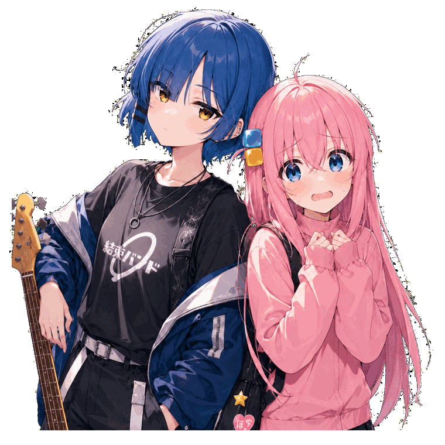

# ZYM / zym-plus

**AI Research Engineer**

*Time-series forecasting · Vision & 3D · Reproducible GPU systems*

[Selected work](#selected-work) · [Repositories](https://github.com/zym-plus?tab=repositories) · [Email](mailto:zymhandsomeman@gmail.com)

<picture>
  <source media="(prefers-reduced-motion: reduce)" srcset="./assets/bocchi-ryo-static.png">
  
</picture>

## Selected work

**01 / Time-series forecasting** 
Lightweight forecasting mechanisms tested against strong baselines, multiple seeds, and explicit ablations.

**02 / Vision and 3D** · [PB](https://github.com/zym-plus/PB) · [YOLO-IOD](https://github.com/zym-plus/yolo-iod) 
Open-world detection reproduction, image restoration, and 3D reconstruction pipelines.

**03 / Research systems** · [Automated Stock Analysis](https://github.com/zym-plus/automated-stock-analysis) 
Local-first AI workflows, GPU automation, structured experiments, and inspectable reports.

## Activity, in 3D

<picture>
  <source media="(prefers-color-scheme: dark)" srcset="./profile-3d-contrib/profile-night-green.svg">
  
</picture>

## Stack

`Python` · `PyTorch` · `CUDA` · `OpenCV` · `Linux / WSL` · `Bash` · `GitHub Actions`

## Contact

Research collaboration or reproducibility questions: [zymhandsomeman@gmail.com](mailto:zymhandsomeman@gmail.com).
