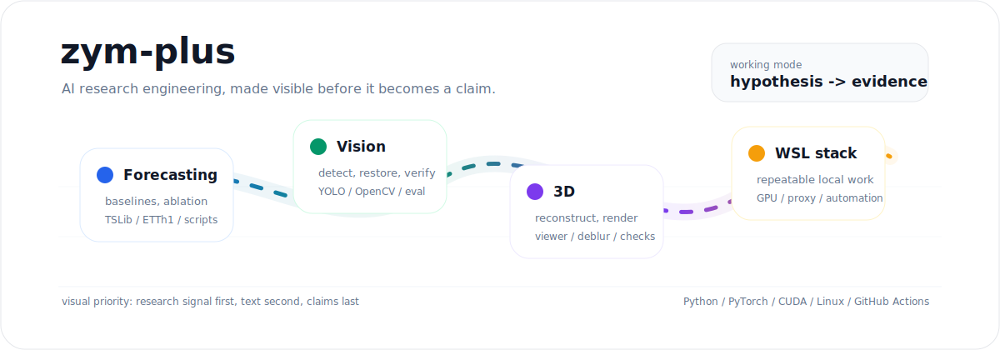

  

  
  
  

  Research engineering for AI systems: forecasting experiments, vision pipelines, 3D reconstruction, and WSL-native tooling.

  
  

  

## Focus

| Direction | What I optimize for | Entry |
|---|---|---|
| Time-series research | Fair baselines, short falsification loops, ablation-first claims | [forecasting repos](https://github.com/zym-plus?tab=repositories&q=time&type=&language=&sort=) |
| Vision and 3D | Detection, deblurring, reconstruction, visual verification | [vision repos](https://github.com/zym-plus?tab=repositories&q=yolo&type=&language=&sort=) |
| WSL research stack | Reproducible local environments, GPU scripts, automation | [tooling repos](https://github.com/zym-plus?tab=repositories&q=wsl&type=&language=&sort=) |

## Stack

  
  
  
  
  
  

Generated activity panels

  

