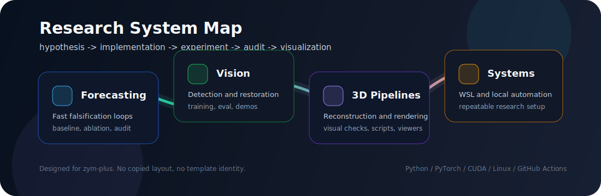
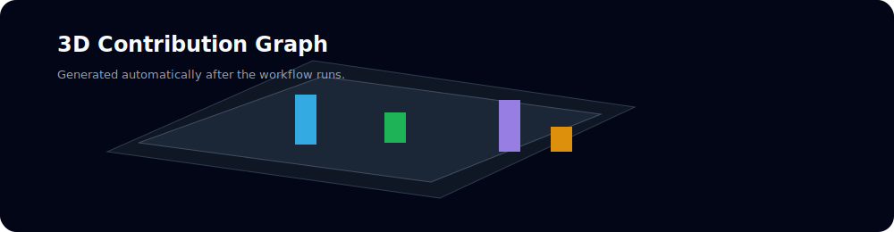

# zym-plus

Research engineering for AI systems: time-series forecasting, computer vision, 3D reconstruction, and practical Linux/WSL tooling.

  

## Current Work

| Track | What I care about | Output style |
|---|---|---|
| Time-series forecasting | Fast falsification loops, fair baselines, contribution-source audits, and lightweight mechanisms that survive ablation. | Reproducible experiments, scripts, reports |
| Computer vision | Detection, restoration, and visual understanding workflows that can move from prototype to usable demo. | Training code, evaluation, demos |
| 3D reconstruction | Deblurring and reconstruction-oriented experiments, with attention to visual verification and practical pipelines. | Scripts, viewers, rendered checks |
| Dev environment | WSL/Linux optimization, automation scripts, and repeatable local research environments. | Setup tools, notes, utilities |

## Project Surface

Instead of a long badge wall, this profile is organized around the way I work: hypothesis, code, experiment, audit, and visualization.

| Area | Repository entry |
|---|---|
| Forecasting research | [Search my time-series repositories](https://github.com/zym-plus?tab=repositories&q=time&type=&language=&sort=) |
| Vision and YOLO work | [Search my vision repositories](https://github.com/zym-plus?tab=repositories&q=yolo&type=&language=&sort=) |
| 3D / reconstruction work | [Search my 3D repositories](https://github.com/zym-plus?tab=repositories&q=3d&type=&language=&sort=) |
| WSL and tooling | [Search my tooling repositories](https://github.com/zym-plus?tab=repositories&q=wsl&type=&language=&sort=) |

  
  

## Toolkit

## Activity Dashboard

  

  

Contribution animation

## Open-Source Components

This profile uses open-source renderers as infrastructure, while the structure and visual language are customized for `zym-plus`.

| Component | Role |
|---|---|
| [`lowlighter/metrics`](https://github.com/lowlighter/metrics) | Generates the compact GitHub metrics panel |
| [`yoshi389111/github-profile-3d-contrib`](https://github.com/yoshi389111/github-profile-3d-contrib) | Generates the 3D contribution calendar |
| [`Platane/snk`](https://github.com/Platane/snk) | Generates the contribution animation |
| [`anuraghazra/github-readme-stats`](https://github.com/anuraghazra/github-readme-stats) | Provides dynamic stats and language cards |

