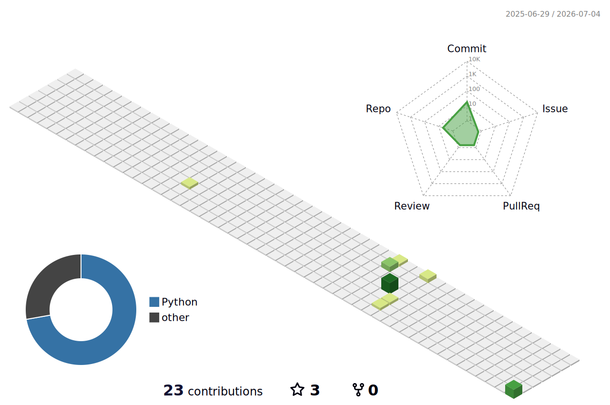
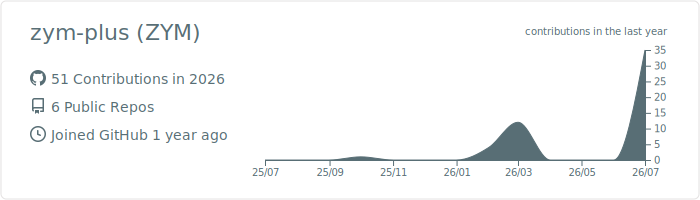

<h1 align="center">zym-plus</h1>

  AI research engineering / time-series forecasting / vision & 3D / WSL-native research stack

  
  
  

  

  

## Working Tracks

| Track | Bias |
|---|---|
| Time-series research | Fast falsification, fair baselines, ablation-first evidence |
| Vision and 3D | Detection, deblurring, reconstruction, visual verification |
| WSL research stack | Reproducible local environments, GPU scripts, automation |

## Stack

`Python` · `PyTorch` · `CUDA` · `OpenCV` · `Linux` · `WSL` · `GitHub Actions`

Visualization sources

- [`yoshi389111/github-profile-3d-contrib`](https://github.com/yoshi389111/github-profile-3d-contrib): 3D contribution calendar.
- [`vn7n24fzkq/github-profile-summary-cards`](https://github.com/vn7n24fzkq/github-profile-summary-cards): compact profile details card.
- [`lowlighter/metrics`](https://github.com/lowlighter/metrics): generated metrics panel, kept in the repository for optional use.

