<a href="#now-playing">
  <picture>
    <source media="(max-width: 640px)" srcset="./assets/research-session-mobile.svg">
    
  </picture>
</a>

[Now playing](#now-playing) / [Work on record](#work-on-record) / [Activity in 3D](#activity-in-3d) / [Repositories](https://github.com/zym-plus?tab=repositories) / [Email](mailto:zymhandsomeman@gmail.com)

**AI research engineer** working across long-horizon forecasting, open-world perception, and reproducible GPU systems. I reduce an idea to its smallest testable mechanism, compare it fairly, and build the tooling needed to inspect the result.

## 01 / Now playing

<b>TRACK 01 / FORECASTING</b> - small mechanisms, hard baselines

 

Current session: long-horizon forecasting in [`Time-Series-Library`](https://github.com/thuml/Time-Series-Library), centered on ETTh1 `336 -> 336`.

- **Question:** can a lightweight mechanism earn its complexity against a strong local baseline?
- **Method:** same split, metric, seed, and budget; fast falsification before long training.
- **Proof required:** multi-seed confirmation and a contribution-source ablation, not one lucky run.

<b>TRACK 02 / PERCEPTION</b> - open worlds, visible evidence

 

- **Incremental detection:** [`YOLO-IOD`](https://github.com/zym-plus/yolo-iod), an AAAI 2026 Poster codebase with LOCO COCO and CPR / IKS / CAKD training paths.
- **Open-world reproduction:** [`PB / PROB`](https://github.com/zym-plus/PB) with real-data GPU smoke tests, staged M-OWODB runs, and HTML / CSV comparisons.
- **Current edge:** image restoration and deblurring-aware 3D Gaussian Splatting.

<b>TRACK 03 / SYSTEMS</b> - local first, repeatable by default

 

- [`Light Quant Copilot`](https://github.com/zym-plus/automated-stock-analysis) turns screenshots and local market data into editable research briefs and Word reports.
- Research runs use isolated environments, scripted GPU jobs, smoke tests, structured logs, and explicit stop / hold / go decisions.
- The goal is simple: another person should be able to understand what ran, what changed, and why the result matters.

## 02 / Work on record

### `PAPER / 01` [YOLO-IOD](https://github.com/zym-plus/yolo-iod)

**Real-time incremental object detection** - [AAAI 2026 paper](https://arxiv.org/abs/2512.22973) 
Official PyTorch implementation, LOCO COCO splits, reproducible evaluation, and explicit CPR / IKS / CAKD experiment paths.

### `REPRO / 02` [PB / PROB](https://github.com/zym-plus/PB)

**Open-world object detection workbench** - [CVPR 2023 paper](https://arxiv.org/abs/2212.01424) 
Server-aware setup, real-data GPU smoke testing, staged M-OWODB orchestration, and inspectable HTML / CSV result output.

### `PRODUCT / 03` [Light Quant Copilot](https://github.com/zym-plus/automated-stock-analysis)

**A local-first market research workflow** 
Screenshot-assisted input, DeepSeek / Qwen routing, SQLite recovery, editable drafts, and `.docx` export for morning, risk, and post-market review.

## 03 / Activity, in 3D

`12-SECOND REPLAY` / a note tracks the year while a particle sweep raises each real contribution week in order.

<a href="https://github.com/zym-plus?tab=overview">
  <picture>
    <source media="(prefers-reduced-motion: reduce) and (prefers-color-scheme: dark)" srcset="./profile-3d-contrib/profile-night-green.svg">
    <source media="(prefers-reduced-motion: reduce)" srcset="./profile-3d-contrib/profile-green.svg">
    <source media="(prefers-color-scheme: dark)" srcset="./profile-3d-contrib/profile-night-green-loop.svg">
    
  </picture>
</a>

[Open source activity](https://github.com/zym-plus?tab=overview) / [Browse repositories](https://github.com/zym-plus?tab=repositories)

## 04 / Instruments

- **Modeling:** `Python` / `PyTorch`
- **Compute:** `CUDA` / `Linux` / `WSL` / `Bash`
- **Perception:** `OpenCV` / object detection / restoration / 3DGS
- **Research operations:** `SQLite` / `Streamlit` / `GitHub Actions`

## 05 / Open channel

Research collaboration, reproducibility questions, or engineering work around forecasting, perception, and GPU workflows: **[zymhandsomeman@gmail.com](mailto:zymhandsomeman@gmail.com)**.
